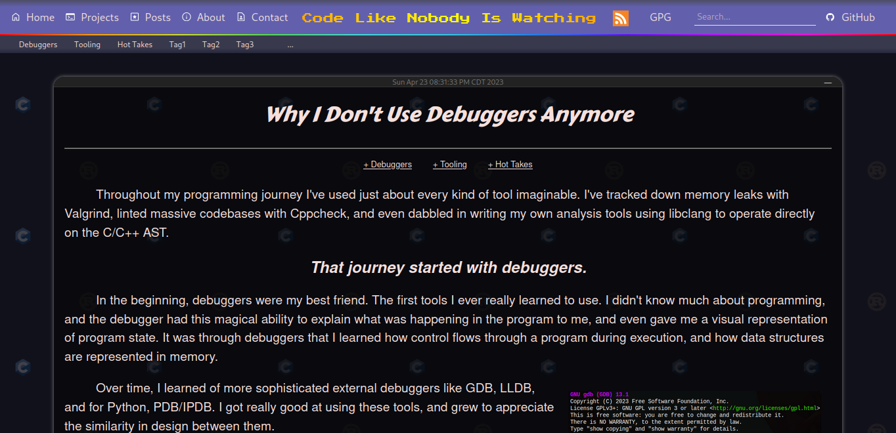

# Project Maintenance Notice

**PLEASE NOTE:** This project is no longer being actively maintained. The code
remains available for those who wish to use or modify it, but it may contain
vulnerabilities or be incompatible with recent versions of any related software,
operating system, or hardware.

## Overview

This is an incomplete website frontend written in React. I think it is mostly
usable, but I never actually used it for production because I got busy and went
on to work on other things.

</img>

Please also note that this repository may require files from
[web-backend](https://github.com/samchristywork/web-backend) and
[web-content](https://github.com/samchristywork/web-content).

## Usage

```sh
npm install
npm run start
```

## Dependencies

```
Node.js
```

## License

This work is licensed under the GNU General Public License version 3 (GPLv3).

[](https://www.gnu.org/licenses/gpl-3.0.en.html)
